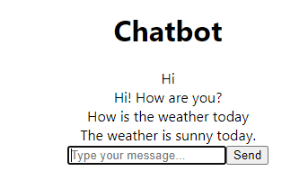

# Chatbot

## Author
Kilian McCabe

## Techniques
-flask
-scikit-learn
-nltk
-react

## Backend (dazu in backend folder wechseln)
pip install flask flask-cors scikit-learn numpy nltk

python -m nltk.downloader punkt averaged_perceptron_tagger (Nur einmal notwendig)

python ./main.py

## Frontend (dazu in frontend folder wehcseln)

npm install

npm start

## Datasets
Datasets are found in python script in backend folder

## Reflection
I learned a lot about scripting and machine learning in this module

## Screenshot
